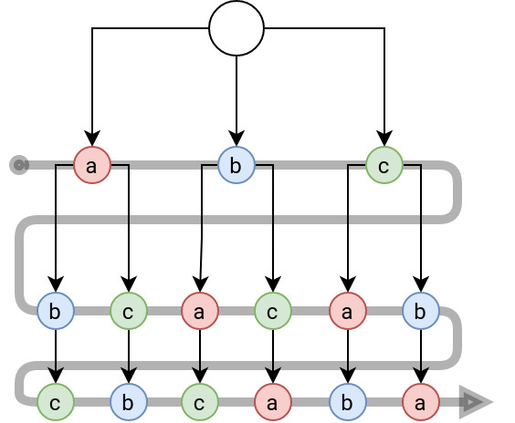
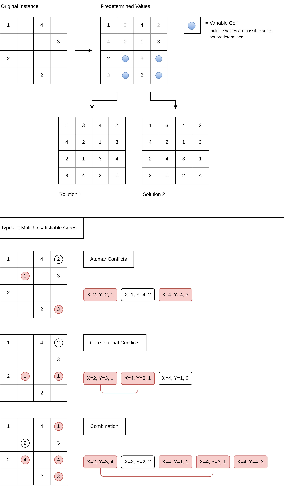
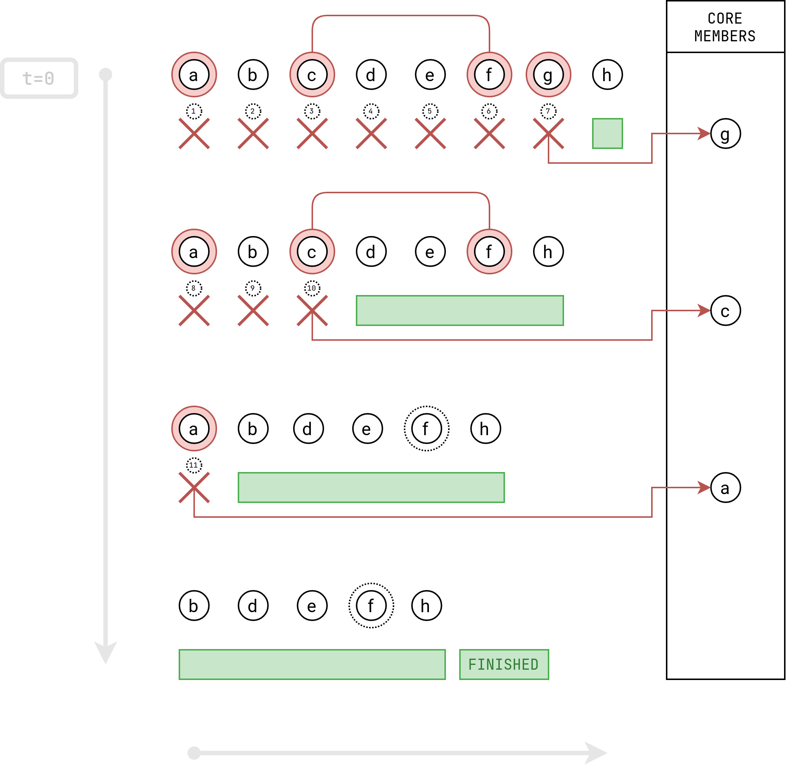

# Working-Diary

***

`15.07.2022` : Freitag

+ Ideas:
	+ The counterexample for the brute force improvement is: `abstract_multi_sat`
	+ It's satisfiable when all the assumptions are met, but $a, b$ aren't possible together without $c$ also being true.
	+ Maybe to combat this I have to look at the cores more as a collection of literals than a collection of assumptions. When I look at negation maybe it's possible to also include this case in the algorithm and make it work.

***

`14.07.2022` : Donnerstag

+ Ideas:
	+ **Idea** Modifying the Brute-Force Algorithm for all Minimal Unsat Cores
		+ First of all we start the Brute Force search upside down (starting with the biggest size subsets)
		+ Then when a subset is concluded to be unsatisfiable we apply the assumption marking algorithm on the `on_core` returned by clingo
		+ The core returned here is minimal and can be added to the minimal core list.
		+ For the assumption marking algorithm to work we assume that cores returned by clingo aren't multi unsat cores! TODO : **Q** : Check if that's true (susana, roland)
		+ Additionally we also record clauses that were satisfiable.
		+ Then when we solve for a smaller subset, we can check if it was part of an already satisfiable bigger subset and skip it.
		+ IMPORTANT : This only works if our domain doesn't allow for a bigger assumption subset that's satisfiable to become unsat when assumptions are removed!
			+ This could possibly exclude interesting domains : **Q** : Check with susana
		+ 
		+ In theory this could allow our approach to become much faster because many subsets can be skipped

***

`13.07.2022` : Mittwoch

***

`08.07.2022` : Freitag

+ Progress:
    + Iterative Deletion Extension doesn't work
        + Sadly I didn't consider intersecting internal cores for my iterative deletion algorithm extension, so it's not guaranteed to find all the MUCs of a core assumption set.
        + an example are the two internal cores $\{b,c,f\}, \{b,r,l\}$
        + if the $b$ is found by the iterative deletion algorithm as a core member, probably only one of the MUCs will be found.
        + **TODO** Still have to check if there's an easy fix
    + We decided to firstly focus on improving the brute force approach and only work on the iterative deletion approach on the side
        + This could be useful in the sense that if we decide to use my algorithm, a formal proof could be neccessary.

***

`06.07.2022` : Mittwoch

+ Progress:
	+ Implemented the extension to the iterative deletion algorithm to find (maybe) all MUCs of the assumption set
	+ For my selected examples it seems to work great!
	+ **TODO** Still would have to check if it works for size-$n$ internal cores with $n>2$
	+ **TODO** Try it with really big assumption sets to see how it performs under more stress

***

`05.07.2022` : Dienstag

+ Progress:
	+ When thinking about it, I think the iterative deletion algorithm doesn't produce minimal unsat cores, it just produces an unsat core, that just contains conflict cores.
		+ This means that each assumption in the found UC is part of a MUC but not necessarily that the found UC is a MUC.
		+ I think though, that this can be improved and fixed by the next algorithm idea!
+ Ideas:
	+ **Idea** Expanding on the idea of finding further MUCs with the iterative deletion algorithm
		+ Consider : 
			+ Full Assumption Set $A = \{A_0, ..., A_n\}$
			+ Found MUC $MUC_i \subseteq A$
			+ Probe Set $P = \varnothing$
		+ Algorithm:
			1. Iterate over assumptions $A_i \in MUC_i$
				1. Set $P=\{A_i\}$
				2. iteratively remove Assumptions $A_j$ from $A \setminus MUC_i$ until it becomes satisfiable united with $P$
					+ when it does before $A \setminus MUC_i$ is empty, add the last added $A_j$ to $P$ and rerun without $A_j$ in $A\setminus MUC_i$
					+ else, the content of $P$ is either the full internal core or an atomic core (if size is $1$)
	+ 
		+ Improvement Potential:
			+ I think, when an internal core part is found, the up to this point deleted assumptions can be discarded, because their deletion didn't yield any result, which the deletion of a MUC member should have.
			+ This would reduce the solving time (to $m*n$?)

***

`01.07.2022` : Freitag

+ Progress:
	+ Implemented the improved Iterative Deletion Algorithm
		+ I implemented the improved iterative deletion algorithm described in the section on `28.06.2022`. It seems to work (at least for my chosen examples) and always returns a minimal unsatisfiable core for the given assumption set.
		+ I still have to do lots of testing but if it turns out, that this approach is viable this might be a great starting point for an efficient MUC finding algorithm
+ Ideas:
	+ **Idea** for improving the findings of the iterative deletion MUC algorithm
		+ Until now the resulting MUC of the algorithm is dependent on the order the assumptions that for the Multi Unsat Core are given in.
		+ This is mainly caused by internal unsat cores in the Multi Unsat Core.
		+ If we, for the beginning, focus on two-pair internal cores, we can, for each found part of an two-pair internal core, find the other corresponding part.
		+ Algorithm:
			1. remove all the assumptions found in the MUC from the assumption set
				+ this should eliminate all atomic cores because the algorithm should be guaranteed to find them
			2. append the found part of the internal core at the end of the assumption set
			3. remove assumptions from the beginning until the instance becomes satisfiable
				+ then the last removed assumption is the corresponding part of the internal core!
		+ Possible critical areas:
			+ Multiple internal cores inside the assumption set
			+ bigger internal cores than two-pair cores
				+ don't know if it works then
				+ but they shouldn't at least be possible in the Sudoku domain 

***

`28.06.2022` : Dienstag

+ Ideas:
	+ **Idea** for an Algorithm that tries to find the Minimum Unsat Core of a Problem by using a Version of Breadth-First-Search:
		+ Imagine a Search Tree for the Assumption-Set $\{a,b,c\}$ which is built like this:
		+ 
		+ When traversing the Search-Tree this way the first Unsat Core that is found will also be the (or one of the) Minimum Unsat Cores.
		+ But due to it being a Breadth-First-Search, the runtime until a Core is found is the same as the exponential approach that is $O(2^n)$ which is not really usable
	+ **Idea** for a Problem Definition: Multi Unsat Cores
		+ A Multi Unsat Core is an Unsat Core that is not Minimal, which in turn contains two other Minimal Unsat Cores $MUC_i$ that are totally independent from each other (No Assumption $A_n \in MUC_i$ is also in another Core $A_n \not\in MUC_j, i\neq j$ )
		+ Illustration on Types of Multi Unsat Cores (For Sudoku Domain):
		+ 
		+ These are the three different kinds of core patterns I could imagine
	+ **Idea** for an Algorithm that is looking for all Independent Minimal Cores of a Multi Unsat Core:
		+ The Idea : Extension to the initial iterative deletion algorithm that retrieves an minimal Unsat Core from the assumption set.
		+ Because we assume that the result of this Algorithm is a minimal Unsat Core we know that none of it's assumption components form another Unsat Core with outside assumptions, because then these assumptions would also have to be part of this Unsat Core.
		+ This means that wen now can remove each assumption that is part of the found MUC and if the original instance is still unsatisfiable the the new reduced assumption set, we can now apply the iterative deletion algorithm again and retrieve a new minimum core.
		+ This will be repeated until the assumption set remnants aren't unsatisfiable anymore.
		+ *UPDATE : DOESN'T WORK : Because if it's a Multi Unsat Core the standard iterative deletion algorithm doesn't work at all b.c. with only marking one atom there will always be another whole MUC inside the Multi Unsat Core.
	+ **Improved Idea** for the iterative deletion algorithm:
		+ Instead of only marking one assumption each iteration step, now in each step another assumption is deleted from the current working set
		+ This continues until the working set becomes satisfiable or only the empty set remains
		+ In either way the last assumption that was removed to make the working set satisfiable / empty is added to the core members list
		+ This assumption is then removed from the original assumption set and the process is repeated
		+ This continues until the remaining assumption set is satisfiable from the start
		+ The Algorithm is illustrated below :
		+ 
		+ One Key constraint is, that it seems to only be possible to find atomic cores forming a Multi Unsat Core this way
		+ But as far as I think, at least for the Sudoku Domain this should be the only type of assumption core that occurs. Or is it? 🤔
	+ **Idea** for a minimum Unsat Core algorithm inside ASP
		1. Transfering the rules of the original program into another program
		2. This program takes all the assumptions of the found UC as soft atoms and tries to find a satisfiable solution while trying to maximize the amount of original assumptions
		+ This strategy should leave us with the maximum satisfiable subset of the assumption set, which would mean, that difference should be the minimum unsatisfiable core?
		+ Not sure if it really works this way 🤔

***

`27.06.2022` : Montag

+ Progress:
	+ Implemented the intuitive search algorithm to find all unsatisfiable cores
		+ this algorithm works and definitely includes all minimal cores and even the minimum core but is highly impractical because of its exponential runtime ($O(2^n)$)
		+ can be used for smaller debugging purposes but is very unlikely to have any practical applications because real world scenarios require big assumption sets and fast solving times.
	+ Thinking about a more efficient Tree search to gather all unsatisfiable cores
		+ Using the fact, that adding facts to an already unsatisfiable core will not make it satisfiable again
		+ so each superset of an already found UC is automatically also an UC.
		+ This approach could also be used to find minimal UCs

*** 

`24.06.2022` : Freitag

+ Progress :
	+ Restructure of the Sudoku code example
	+ Added a `Container` class that contains the `program` `insatnce` and `assumptions`.
		+ This `Container` class is used to efficiently solve for different assumption sets and will be used in the future to house my different MUC algorithms
		+ When a new `Container` is created a control Object is created and directly ground with the related `program` and `instance`
	+ Revised the clingraph Sudoku rendering function, so that it takes a list of symbols as input instead of the instance paths
		+ These Symbols are function internally converted to strings and restructured into the typical asp format, so they can be used as a program string for `clingo.Control.solve()`
	+ Ported to iterative deletion MUC function to the `Container` class
		+ Now computes way more efficiently than before
		+ **IMPORTANT** : 
			+ still doesn't guarantee to find all the minimal cores or the minimum core
			+ this algorithm doesn't seem to be capable to find all MUCs or the minimum core. So it will be necessary to implement further algorithms that deals with these problems
	+ Started to implement an algorithm to retrieve all minimal unsatisfiable core from an instance
		+ Still Work in Progress

***

`23.06.2022` : Donnerstag

+ Progress :
	+ Fixed the clingraph Sudoku Visualization
		+ Removed the `os.system()` call which wasn't a very elegant solution in the first place
		+ Replaced this functionality with adding a model directly to the Factbase with `clingraph.orm.Factbase.add_model()`. This model can be computed using the normal clingo API but needs a `ClingraphContext()` when it's ground to provide the `pos(x,y)` function.

***

`20.06.2022` : Montag

+ Progress : 
	+ Implemented the first minimal unsatisfiable core algorithm : iterative deletion
		+ This algorithm is very simplistic. It takes a core returned by the clingo solver for an instance with unsatisfiable assumptions and iterates one time over it. In each step one assumption of the core is marked and excluded from the core, which like this forms the new assumption set. The solver is then run again on the same instance with the new assumption set. If the instance becomes satisfiable like this, the this current marked assumption is added to the minimal unsatisfiable core, because it is necessary for the problem to be unsatisfiable.
		+ This algorithm is only guaranteed to find one possible minimal unsatisfiable core. It's uncertain if this core is also the minimum unsatisfiable core or if there are more MUCs.

***

`17.06.2022` : Freitag

+ Progress
	+ Created the first MUC Project using Sudoku as an example domain
	+ Added the clingraph Visualization
		+ Implemented a Sudoku visualizer using the clingraph library.
		+ Used the example from the [clingraph-github](https://github.com/potassco/clingraph/tree/master/examples/sudoku) as a guideline
		+ Designed and implemented a dark theme for the Sudoku visualizer to understand the encoding format better and make my outputs look nicer
