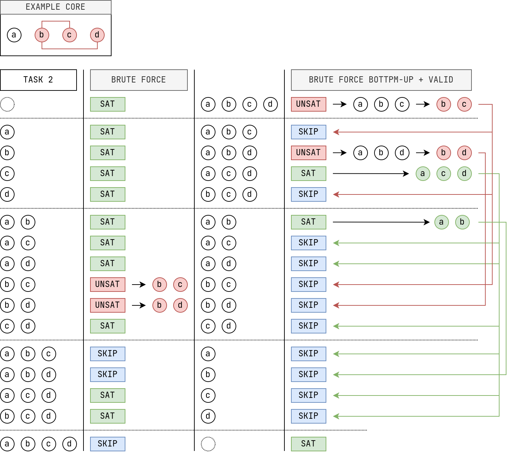

# Working-Diary

***
`26.09.2022` : Montag

+ While trying to implement an efficient skipping method I discovered that the fastest way is using sets and do subset checking
	+ To make the approximate algorithms for Task 3 and 4 more efficient I was looking for efficient ways of skipping all the skippable subsets of the search space
	+ I envisioned a method where bitmasks, that represent the assumption members for a current subset, are used to efficiently check against already found minimal cores
	+ This approach works and I implemented it with python bitarrays and numpy arrays
	+ BUT against my intuition when I again checked it against a valid implementation of the same process using python sets and the `issubset` / `issuperset` methods to skip subsets, it turned out to be WAY FASTER!
	+ I probably didn't notice it before because in my initial implementation my subsets weren't represented in the right way
	+ I guess this is because `issubset` already is a very performant standard function for this type of task that works on hashable objects.
	+ My guess is, that the set is represented through an internally generated hash table which is also used to check the `issubset` or `issuperset` condition in the most effective way
	+ The python documentation isn't very helpful in this way, but as is commonly known are python internals most of the time the fastest and easiest way to do things in python.

***
`13.09.2022` : Dienstag

+ Progress :
	+ Cleanup
	+ Trying to prove stopping condition for 2 consecutive SAT/SKIP Layers
	+ Trying Efficient Ways of skipping
		+ Using bitmasks to represent subsets
			+ Any other more efficient ideas?
+ What to Do?
	+ Only Implement approximated version for Task 2
		+ Stopping after time is exceeded
		+ Stopping after $n$ cores are found
		+ both
		+ etc.
		+ Using the efficient Skipping method
	+ Modify the Task 2 Algorithm to find a guaranteed minimum core
		+ allows for much more skipping if a small core is found
		+ still could take pretty long to terminate
		+ That's why also use an approximated version with stopping constraint (time)
	+ Any other important Tasks left?
	+ Else I would focus on :
		1. Creating Benchmarks
		2. Writing the Application Class
		3. Continuing work on my thesis paper

***
`01.09.2022` : Donnerstag
+ Ideas :
	+ New Idea : Use ASP to find the next biggest unskippable subset
		+ Use an ASP Program here as some kind of oracle, which gives us the next biggest unskippable subset
		+ Start of with all assumptions and no oracle call
		+ Then after the first MUC is found, add this MUC to the program and exclude all subsets via constraints 
		+ This should also minimize the grounded tree more and more with each step
		+ When there is no set left (UNSAT) : All Subsets have been checked or skipped
		+ Is this a good idea? 🤔
+ TODO :
	+ Cleanup-Code in `main.py` and `minimal_unsatisfiable_core.py`
		+ Move all the temporary main functions into Util 
		+ Cleanup the Task 2 Algorithms so that only the following are left :
			+ It Del Task 2 : without stopping : naive
			+ It Del Task 2 : with stopping (EVEN THOUGH IT'S NOT ALWAYS CORRECT)
			+ It Del Task 2 : with ASP oracle (ToBeImplemented)
			+ It Del Task 2 : without stopping : more efficient (ToBeImplemented)

***
`29.08.2022` : Montag
+ The stopping approach doesn't work 😞
	+ While trying to prove it, I encountered a counter example
	+ These types of example occur, when there is an unsat core in the layer under the fully skippable/satisfiable layer. For this unsat core, all supersets in the skippable/sat layer have to be skipped, because they contain another unsat core, which necessarily has to contain the assumption that isn't in the MUC subset
	+ When all of these are skipped, it is possible for the MUC not to be found beforehand, and thus be never found! (NOT ACCEPTABLE)
	+ Counter-Example :
		+ 

***
`24.08.2022` : Mittwoch
+ Ideas : 
	+ Idea with stopping after the first fully skippable/satisfiable layer should work
	+ Every instance that is **skipped** *contains* an already found minimal core or would if minimal *invalidate* an already found minimal core
		+ This also leaves the possibility for the skipped subset to contain additionally to the known minimal core another undiscovered minimal core
		+ But since each lower layer contains all permutations of subsets that are missing one assumption, the other core should be found in the next layer if not earlier
	+ Every subset that is **satisfiable** makes all smaller subsets that are also subsets of the the sat set invalid as minimal core candidates
		+ This should cover all potential subsets that aren't already skippable
	+ IDEA : Make the skips more efficient
		+ Approach 1 :
			+ After a MUC is found : Compute all instances that this found MUC allows to be skipped and enter them in a Hash-Map
			+ This is not the best idea, since the amount of subsets that can be skipped increases not with core-size, but with the size of the original assumption-set
			+ For example : see how many subsets can be skipped when $\lbrace a\rbrace$ is found to be a MUC :

| $\|A\|$| 2|3|4|5|
|:-:|:-:|:-:|:-:|:-:|
|skipped| 2|4|8|16|

***
`22.08.2022` : Montag
+ Ideas : 
	+ My algorithm idea, doesn't work! Stopping after having cleared the level where the first satisfiable subset is found isn't sufficient to guarantee having found all subsets!
	+ Counter Example :
		+ 
	+ Modification : Maybe it should suffice stopping after the first fully skippable / satisfiable layer
	+ since we know that all subsets would either result in an already found minimal core or are satisfiable, and since we covered a full layer, should cover the whole search-space ? 🤔
	+ IDEA : To make the Skipping process faster : Use a hash-table (dict) to store information on skippable subsets after a core / valid subset is found rather than checking for each subset the whole core and sat list individually

***

`18.08.2022` : Donnerstag
+ Progress :
	+ Implemented the algorithm idea, that is stopping after having reached the first satisfiable subset
	+ With a slight modification, that it has to solve the whole layer where the satisfiable instance was found to finish

***

`17.08.2022` : Mittwoch
+ Ideas :
	+ The idea (from yesterday) should work
	+ It is effectively just excluding both (bigger and smaller) subsets from the searchtree in contrast to just excluding bigger subsets (before)
	+ These (smaller) exclusions were made in the previous algorithm when we found a satisfiable subset, but they can also be made for minimal unsat cores
	+ Another nice side effect is, that we can save some solver calls because more reductions are possible from each found core
	+ Here are some examples :
		+ The Counter example that broke the first version :
		+ 
		+ on the left : previous version
		+ on the right : new version that excludes smaller and bigger subsets
		+ I also applied this version on my bigger example again and it still works like a charm 
		+ 
+ TODO :
	+ Though it's nice that the algorithm is working, there's still a big caveat!
	+ This is that for big instances (original core size $\sim 100$) the search tree is so gigantic that checking all the subsets still takes an eternity
	+ I will have to look into what's the most efficient way to check for the skip condition so that this becomes as fast as possible

***

`16.08.2022` : Dienstag

+ Ideas :
	+ Sadly my idea for stopping after the first found solvable instance doesn't work 😔
	+ COUNTER EXAMPLE : 
		+ $\lbrace a,b,c,d\rbrace$
		+ Minimal Cores : $\lbrace d,c,b \rbrace, \lbrace a,b \rbrace, \lbrace a,c \rbrace, \lbrace a,d\rbrace$
	+ At least not in this algorithm state :
		+ I think when we find a minimal core, we can exclude more subsets!!
		+ When iterative deletion really always works (which I think it does) we can assume that each found result is a minimal core
		+ This also means, that additionally to excluding all the subsets that contain the whole core, we can exclude all subsets that itself are full subsets of the minimal core
		+ This is because if they would be an unsat core, our just found minimal unsat core wouldn't be minimal anymore
		+ But because it is, these other subsets cannot be minimal cores!!
	+ I think with this addition to my algorithm the stopping after the first satisfiable instance should be possible again 🤔

***

`14.08.2022 + 15.08.2022` : Sonntag + Montag

+ Ideas :
	+ Tackling Task 2 and 3 :
		1. Look at Task 2 and then task 3, bc. task 2 is more general
		+ Thinking about the structure of cores :
			+ How many minimal core can an unsat core maximally contain?
				+ If there are many small cores : *its harder for bigger cores to exist and not contain the smaller cores*
				+ If many big cores exist : *you can't have too many small cores without making some of the big cores not minimal*
				+ Since finding subsets of size $x,\ 0 \le x \le n,\ n=|core|$ of the core follows a Binomial distribution, our core candidates look like this :
				+ 
				+ As you can see either choosing a big core or small core already eliminates many other possible subsets from being a core
				+ 
				+ 
				+ What's also observable is, that choosing a subset from one level doesn't eliminate any subsets on that same level
				+ So we can use this fact to find the level with the most subsets and just choose all those subsets as cores and should have the biggest possible amount of minimal cores like this.
				+ The biggest level in a binomial distribution is always $l = \lfloor\dfrac{n}{s}\rfloor$
					+ since $l$ has to be an integer we can just take the floor of $\dfrac{n}{s}$ because if $n$ is odd both levels $l= \lfloor\dfrac{n}{s}\rfloor$ and $l = \lfloor\dfrac{n}{s}\rfloor + 1$ have always the same number of subsets
				+ 
				+ 
				+ This also makes the worst case number of minimal cores $|cores| = \dbinom{n}{\lfloor\dfrac{n}{2}\rfloor}$
				+ This means that any algorithm to find all those cores would have to take at least $\dbinom{n}{\lfloor\dfrac{n}{2}\rfloor}$ steps, which would indicate a runtime class that is sadly non-polynomial
				+ This makes the whole problem of finding all minimal/minimum cores inherently non-polynomial in the worst case!
				+ But since in most cases those cores shouldn't be so dense and many I think there's still reason to look for an efficient way to solve them
		+ Algorithm Idea:
			+ Taking the basic idea of the Brute Force approach
			+ Starting Bottom-Up and use the iterative deletion algorithm for Task 5 to get any minimal unsatisfiable core
			+ Then use the found minimal core, to exclude all branches of the search tree, that include this core
			+ This should in theory still take the same amount of solver calls as the brute force algorithm
			+ But maybe since we check each subset for any minimal unsat core we can also exclude subsets from satisfiable instances and increase its speed this way? 🤔
			+ Illustration how this algorithm would work
			+ 
		+ Down below illustrated is the algorithm execution on a dense core distribution problem which has the maximum number of minimal cores :
		+ 
		+ Another very useful side effect seems to be that up until one point all solver call seem to be unsatisfiable and after the first call is satisfiable no other unsat subset is found!
		+ I think this is because, when we are going bottom up, starting with the biggest set, and trimming the tree on the way to exclude finding the same core twice, we probably necessarily have to find a new core with each new solver call until none are left 🤔 (JUST MY HYPOTHESIS : MUST BE TESTED!!!!)
		+ If this truly is the case we can improve the runtime even more! By just simply stopping the algorithm after the first instance gets satisfiable.
		+ This would improve the runtime drastically and would make the runtime $O(|core| * n)$ (number of minimal cores times linear runtime for the iterative deletion algorithm)
		+ This is still sadly non-polynomial in the worst case of dense minimal core distribution
		+ But I guess for regular problems this could be a nice improvement on the brute force variant of finding all minimal cores
+ TODO :
	+ Still find a way to dynamically iterate over subsets

***

`13.08.2022` : Samstag

+ Progress :
	+ Implemented orkunt's idea for improving the performance of the iterative deletion algorithm for Task 5
		+ it seems to work fine!
	+ Implemented Idea to solve Task 2 with iterative Deletion
		+ This idea is basically applying iterative deletion multiple times on a selected subset of subset permutations derived from the found minimal cores on the way
		1. The first queue Element is popped
		3. Iterative Deletion is applied on the difference of the assumption set minus the popped assumption from the queue
		4. The found `muc` is stored 
			1. If the `muc` is atomic its assumption is removed from the assumption set
				+ The checked list is reset to an empty list
			+ all assumptions contained in `muc` (that aren't yet in the checked list) are added to the queue and marked as checked
+ TODO :
	+ Do a pseudocode implementation
	+ Visualize one example
	+ Ask susana what she thinks about it

***

`10.08.2022` : Donnerstag

+ Ideas:
	+ Removing Atomic Cores:
		+ When thinking about an algorithm to find all minimal cores atomic cores seem to get in the way
		+ It should possible to remove them from the assumption set, once they are identified, because, via definition, there cant be any other minimal core that contains an atomic core!
		+ so a core that contains multiple intersecting cores linke $b, c$ and $b,d$ isn't possible with an atomic core assumption
	+ Maybe with this removing an iterative deletion approach for all minimal cores could work? 🤔

***

`10.08.2022` : Mittwoch

+ Ideas:
	+ Worst-Case for Iterative Deletion

***

`03.08.2022` : Mittwoch

+ Infos:
	+ Multi Sat Problems can be disregarded because they are satisfiable in the normal case if all assumptions are assumed
+ TODO:
	+ Look into negative assumptions ex.: `a, not b.`
		+ Does this change anything in how I should approach these algorithms, or even makes them invalid?
	+ Randomly generated benchmarks
		+ Iteratively generating bigger cores:
			+ Multi Core that contains 1 random core
			+ Multi Core that contains 2 random cores
			+ ...
	+ Also Look for standard examples that might be used for benchmarks in ASP
	+ For Benchmarking also track the reduction of core size as a measure in addition to to solving time
	+ For Thesis do a pseudo-code implementation of the iterative Deletion aglorithm
	+ Proving iterative Deletion
		+ Firstly looking for other papers that may have mentioned the iterative deletion approach
	+ For application class:
		+ Define a flag that starts with the clingo `on_core`

***

`30.07.2022` : Samstag

+ Progress : 
	+ Added a way to benchmark my algorithms :
		+ They can now be timed with the function `measure_function()` and it is also possible to set a `TIMEOUT` time, that kills the function if it exceeds a certain time limit.
	+ Did a bit of cleanup in main.py and also fixed some algorithm return values for a satisfiable instance
+ TODO :
	+ Add a way to benchmark automatically completely with result checking
		+ Therefore store all possible results as a `.csv` or `.json` file for each example
		+ Maybe a file with all minimum cores and one with all minimal cores? 🤔
		+ Could also do a file with all unsatisfiable cores, but that could get pretty big 🤔

***

`29.07.2022` : Freitag

+ Progress :
	+ Did a big cleanup of algorithm names
	+ Added a few algorithm implementations that were mentioned but not implemented yet
		+ Also added documentation for them in [concepts](concepts.md)
	+ Added a way to test multiple examples in a row 
	+ Some code cleanup :
		+ removing iterative deletion algorithms for task 2, because they aren't working
	+ Added a new BIG abstract example, that is the first example my laptop gets sweaty with when using the brute force approaches
		+ The only algorithm that was still able to perform was the new iterative deletion algorithm for task 5 (possibly also the assumption marking algorithm but i didn't test it yet, also don't know if it is applicable here)

***

`27.07.2022` : Mittwoch

+ Infos:
	+ Roland : We cannot assume that cores returned by clingo aren't Multi-Unsat-Cores !
	+ This means that I have to rethink some approaches and this also makes the general idea of using Unsat cores to optimize an algorithm (i.e. Brute-Force) very unlikely, because firstly reducing them is also a big task in itself.
+ Organizational:
	+ No meeting with Orkunt next week
	+ No meeting with Susana on `10.08.2022`
+ Ideas:
	+ When an atomic core is found :
		+ Extending the assumption set with all the facts to find the corresponding fact that creates the atomic Unsat-Core.
		+ This makes sense for Sudoku but not necessarily for other domains? 🤔
	+ Brute-Force improvement:
		+ Generating subsets to check next on demand, not all before
			+ This could be useful because checking if one smaller subset is subset of a bigger set can also get quite computationally inefficient
	+ Look at clingo-application-classes
		+ To make my finished algorithms viable as command-line tools
	+ Idea to use iterative deletion for Task 5:
		+ 
		+ This could work
		+ The algorithm can probably be even more simplified by just starting with an empty probe set
+ TODO:
	+ start with thinking of a basic thesis structure
	+ maybe find a good LaTeX template
	+ compile thesis name ideas and check them next week with Susana
	+ fix my algorithm naming
+ Progress:
	+ Added visualization of unsatisfiable instances:
		+ All the core members are marked with red background 
		+ This should also still work for satisfiable instances
	+ Added some abstract examples

***

`19.07.2022` : Dienstag

+ Ideas:
	+ Maybe the iterative deletion algorithm can be salvaged to solve task 5 efficiently 🤔

***

`15.07.2022` : Freitag

+ Ideas:
	+ The counterexample for the brute force improvement is: `abstract_multi_sat`
	+ It's satisfiable when all the assumptions are met, but $a, b$ aren't possible together without $c$ also being true.
	+ Maybe to combat this I have to look at the cores more as a collection of literals than a collection of assumptions. When I look at negation maybe it's possible to also include this case in the algorithm and make it work.

***

`14.07.2022` : Donnerstag

+ Ideas:
	+ **Idea** Modifying the Brute-Force Algorithm for all Minimal Unsat Cores
		+ First of all we start the Brute Force search upside down (starting with the biggest size subsets)
		+ Then when a subset is concluded to be unsatisfiable we apply the assumption marking algorithm on the `on_core` returned by clingo
		+ The core returned here is minimal and can be added to the minimal core list.
		+ For the assumption marking algorithm to work we assume that cores returned by clingo aren't multi unsat cores! TODO : **Q** : Check if that's true (susana, roland)
		+ Additionally we also record clauses that were satisfiable.
		+ Then when we solve for a smaller subset, we can check if it was part of an already satisfiable bigger subset and skip it.
		+ IMPORTANT : This only works if our domain doesn't allow for a bigger assumption subset that's satisfiable to become unsat when assumptions are removed!
			+ This could possibly exclude interesting domains : **Q** : Check with susana
		+ 
		+ In theory this could allow our approach to become much faster because many subsets can be skipped

***

`13.07.2022` : Mittwoch

+ Progress:
	+ Updated the Container class to work now with just a reference to a directory that follows the example template detailed in [examples](../sudoku_muc/res/examples)
	+ Also added a recursive read-in function that includes the contents of with `#include` included files

***

`08.07.2022` : Freitag

+ Progress:
    + Iterative Deletion Extension doesn't work
        + Sadly I didn't consider intersecting internal cores for my iterative deletion algorithm extension, so it's not guaranteed to find all the MUCs of a core assumption set.
        + an example are the two internal cores $\{b,c,f\}, \{b,r,l\}$
        + if the $b$ is found by the iterative deletion algorithm as a core member, probably only one of the MUCs will be found.
        + **TODO** Still have to check if there's an easy fix
    + We decided to firstly focus on improving the brute force approach and only work on the iterative deletion approach on the side
        + This could be useful in the sense that if we decide to use my algorithm, a formal proof could be neccessary.

***

`06.07.2022` : Mittwoch

+ Progress:
	+ Implemented the extension to the iterative deletion algorithm to find (maybe) all MUCs of the assumption set
	+ For my selected examples it seems to work great!
	+ **TODO** Still would have to check if it works for size-$n$ internal cores with $n>2$
	+ **TODO** Try it with really big assumption sets to see how it performs under more stress

***

`05.07.2022` : Dienstag

+ Progress:
	+ When thinking about it, I think the iterative deletion algorithm doesn't produce minimal unsat cores, it just produces an unsat core, that just contains conflict cores.
		+ This means that each assumption in the found UC is part of a MUC but not necessarily that the found UC is a MUC.
		+ I think though, that this can be improved and fixed by the next algorithm idea!
+ Ideas:
	+ **Idea** Expanding on the idea of finding further MUCs with the iterative deletion algorithm
		+ Consider : 
			+ Full Assumption Set $A = \{A_0, ..., A_n\}$
			+ Found MUC $MUC_i \subseteq A$
			+ Probe Set $P = \varnothing$
		+ Algorithm:
			1. Iterate over assumptions $A_i \in MUC_i$
				1. Set $P=\{A_i\}$
				2. iteratively remove Assumptions $A_j$ from $A \setminus MUC_i$ until it becomes satisfiable united with $P$
					+ when it does before $A \setminus MUC_i$ is empty, add the last added $A_j$ to $P$ and rerun without $A_j$ in $A\setminus MUC_i$
					+ else, the content of $P$ is either the full internal core or an atomic core (if size is $1$)
	+ 
		+ Improvement Potential:
			+ I think, when an internal core part is found, the up to this point deleted assumptions can be discarded, because their deletion didn't yield any result, which the deletion of a MUC member should have.
			+ This would reduce the solving time (to $m*n$?)

***

`01.07.2022` : Freitag

+ Progress:
	+ Implemented the improved Iterative Deletion Algorithm
		+ I implemented the improved iterative deletion algorithm described in the section on `28.06.2022`. It seems to work (at least for my chosen examples) and always returns a minimal unsatisfiable core for the given assumption set.
		+ I still have to do lots of testing but if it turns out, that this approach is viable this might be a great starting point for an efficient MUC finding algorithm
+ Ideas:
	+ **Idea** for improving the findings of the iterative deletion MUC algorithm
		+ Until now the resulting MUC of the algorithm is dependent on the order the assumptions that for the Multi Unsat Core are given in.
		+ This is mainly caused by internal unsat cores in the Multi Unsat Core.
		+ If we, for the beginning, focus on two-pair internal cores, we can, for each found part of an two-pair internal core, find the other corresponding part.
		+ Algorithm:
			1. remove all the assumptions found in the MUC from the assumption set
				+ this should eliminate all atomic cores because the algorithm should be guaranteed to find them
			2. append the found part of the internal core at the end of the assumption set
			3. remove assumptions from the beginning until the instance becomes satisfiable
				+ then the last removed assumption is the corresponding part of the internal core!
		+ Possible critical areas:
			+ Multiple internal cores inside the assumption set
			+ bigger internal cores than two-pair cores
				+ don't know if it works then
				+ but they shouldn't at least be possible in the Sudoku domain 

***

`28.06.2022` : Dienstag

+ Ideas:
	+ **Idea** for an Algorithm that tries to find the Minimum Unsat Core of a Problem by using a Version of Breadth-First-Search:
		+ Imagine a Search Tree for the Assumption-Set $\{a,b,c\}$ which is built like this:
		+ 
		+ When traversing the Search-Tree this way the first Unsat Core that is found will also be the (or one of the) Minimum Unsat Cores.
		+ But due to it being a Breadth-First-Search, the runtime until a Core is found is the same as the exponential approach that is $O(2^n)$ which is not really usable
	+ **Idea** for a Problem Definition: Multi Unsat Cores
		+ A Multi Unsat Core is an Unsat Core that is not Minimal, which in turn contains two other Minimal Unsat Cores $MUC_i$ that are totally independent from each other (No Assumption $A_n \in MUC_i$ is also in another Core $A_n \not\in MUC_j, i\neq j$ )
		+ Illustration on Types of Multi Unsat Cores (For Sudoku Domain):
		+ 
		+ These are the three different kinds of core patterns I could imagine
	+ **Idea** for an Algorithm that is looking for all Independent Minimal Cores of a Multi Unsat Core:
		+ The Idea : Extension to the initial iterative deletion algorithm that retrieves an minimal Unsat Core from the assumption set.
		+ Because we assume that the result of this Algorithm is a minimal Unsat Core we know that none of it's assumption components form another Unsat Core with outside assumptions, because then these assumptions would also have to be part of this Unsat Core.
		+ This means that wen now can remove each assumption that is part of the found MUC and if the original instance is still unsatisfiable the the new reduced assumption set, we can now apply the iterative deletion algorithm again and retrieve a new minimum core.
		+ This will be repeated until the assumption set remnants aren't unsatisfiable anymore.
		+ *UPDATE : DOESN'T WORK : Because if it's a Multi Unsat Core the standard iterative deletion algorithm doesn't work at all b.c. with only marking one atom there will always be another whole MUC inside the Multi Unsat Core.
	+ **Improved Idea** for the iterative deletion algorithm:
		+ Instead of only marking one assumption each iteration step, now in each step another assumption is deleted from the current working set
		+ This continues until the working set becomes satisfiable or only the empty set remains
		+ In either way the last assumption that was removed to make the working set satisfiable / empty is added to the core members list
		+ This assumption is then removed from the original assumption set and the process is repeated
		+ This continues until the remaining assumption set is satisfiable from the start
		+ The Algorithm is illustrated below :
		+ 
		+ One Key constraint is, that it seems to only be possible to find atomic cores forming a Multi Unsat Core this way
		+ But as far as I think, at least for the Sudoku Domain this should be the only type of assumption core that occurs. Or is it? 🤔
	+ **Idea** for a minimum Unsat Core algorithm inside ASP
		1. Transfering the rules of the original program into another program
		2. This program takes all the assumptions of the found UC as soft atoms and tries to find a satisfiable solution while trying to maximize the amount of original assumptions
		+ This strategy should leave us with the maximum satisfiable subset of the assumption set, which would mean, that difference should be the minimum unsatisfiable core?
		+ Not sure if it really works this way 🤔

***

`27.06.2022` : Montag

+ Progress:
	+ Implemented the intuitive search algorithm to find all unsatisfiable cores
		+ this algorithm works and definitely includes all minimal cores and even the minimum core but is highly impractical because of its exponential runtime ($O(2^n)$)
		+ can be used for smaller debugging purposes but is very unlikely to have any practical applications because real world scenarios require big assumption sets and fast solving times.
	+ Thinking about a more efficient Tree search to gather all unsatisfiable cores
		+ Using the fact, that adding facts to an already unsatisfiable core will not make it satisfiable again
		+ so each superset of an already found UC is automatically also an UC.
		+ This approach could also be used to find minimal UCs

*** 

`24.06.2022` : Freitag

+ Progress :
	+ Restructure of the Sudoku code example
	+ Added a `Container` class that contains the `program` `insatnce` and `assumptions`.
		+ This `Container` class is used to efficiently solve for different assumption sets and will be used in the future to house my different MUC algorithms
		+ When a new `Container` is created a control Object is created and directly ground with the related `program` and `instance`
	+ Revised the clingraph Sudoku rendering function, so that it takes a list of symbols as input instead of the instance paths
		+ These Symbols are function internally converted to strings and restructured into the typical asp format, so they can be used as a program string for `clingo.Control.solve()`
	+ Ported to iterative deletion MUC function to the `Container` class
		+ Now computes way more efficiently than before
		+ **IMPORTANT** : 
			+ still doesn't guarantee to find all the minimal cores or the minimum core
			+ this algorithm doesn't seem to be capable to find all MUCs or the minimum core. So it will be necessary to implement further algorithms that deals with these problems
	+ Started to implement an algorithm to retrieve all minimal unsatisfiable core from an instance
		+ Still Work in Progress

***

`23.06.2022` : Donnerstag

+ Progress :
	+ Fixed the clingraph Sudoku Visualization
		+ Removed the `os.system()` call which wasn't a very elegant solution in the first place
		+ Replaced this functionality with adding a model directly to the Factbase with `clingraph.orm.Factbase.add_model()`. This model can be computed using the normal clingo API but needs a `ClingraphContext()` when it's ground to provide the `pos(x,y)` function.

***

`20.06.2022` : Montag

+ Progress : 
	+ Implemented the first minimal unsatisfiable core algorithm : iterative deletion
		+ This algorithm is very simplistic. It takes a core returned by the clingo solver for an instance with unsatisfiable assumptions and iterates one time over it. In each step one assumption of the core is marked and excluded from the core, which like this forms the new assumption set. The solver is then run again on the same instance with the new assumption set. If the instance becomes satisfiable like this, the this current marked assumption is added to the minimal unsatisfiable core, because it is necessary for the problem to be unsatisfiable.
		+ This algorithm is only guaranteed to find one possible minimal unsatisfiable core. It's uncertain if this core is also the minimum unsatisfiable core or if there are more MUCs.

***

`17.06.2022` : Freitag

+ Progress
	+ Created the first MUC Project using Sudoku as an example domain
	+ Added the clingraph Visualization
		+ Implemented a Sudoku visualizer using the clingraph library.
		+ Used the example from the [clingraph-github](https://github.com/potassco/clingraph/tree/master/examples/sudoku) as a guideline
		+ Designed and implemented a dark theme for the Sudoku visualizer to understand the encoding format better and make my outputs look nicer
