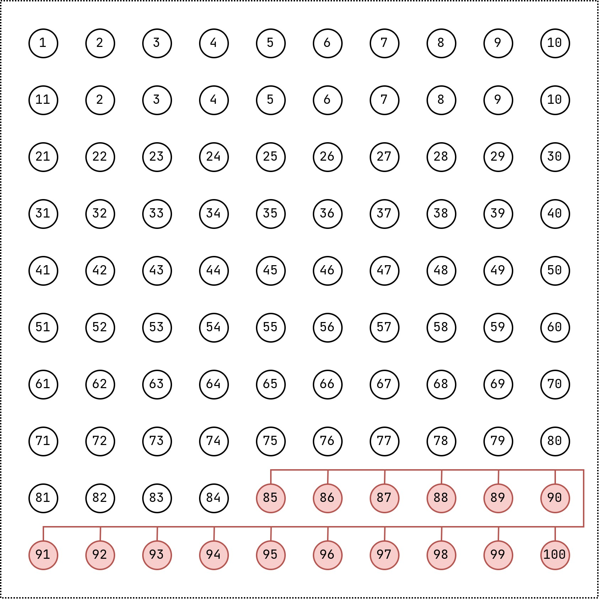

# Example : Abstract Multi Core - Medium

This is an abstract example for a big standard multi unsat core.

## Minimal Cores

+ $\lbrace a(85), a(86), a(87), a(88), a(89), a(90), a(91), a(92), a(93), a(94), a(95), a(96), a(97), a(98), a(99), a(100) \rbrace$

## Minimum Cores

+ $\lbrace a(85), a(86), a(87), a(88), a(89), a(90), a(91), a(92), a(93), a(94), a(95), a(96), a(97), a(98), a(99), a(100) \rbrace$
