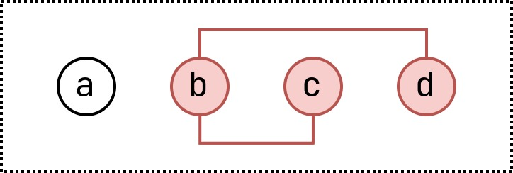

# Example : Abstract Multi Core - Intersecting

This is an abstract example for an intersecting multi unsat core.

## Minimal Cores

+ $\lbrace b, c \rbrace$
+ $\lbrace b, d \rbrace$

## Minimum Cores

+ $\lbrace b, c \rbrace$
+ $\lbrace b, d \rbrace$