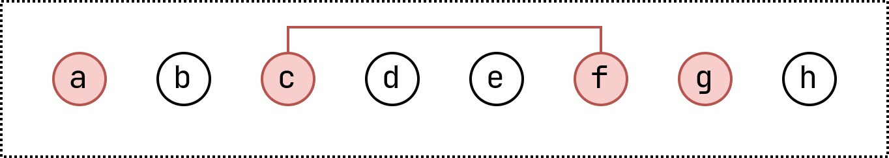

# Example : Abstract Multi Core - Medium

This is an abstract example for a standard multi unsat core of medium size.

## Minimal Cores

+ $\lbrace a \rbrace$
+ $\lbrace g \rbrace$
+ $\lbrace c, f \rbrace$

## Minimum Cores

+ $\lbrace a \rbrace$
+ $\lbrace g \rbrace$