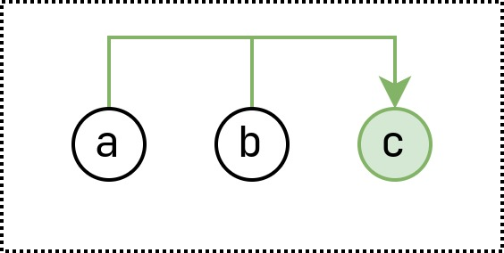

# Example : Abstract Multi Sat

This is an abstract example for an instance that is satisfiable with all 
assumptions in the assumption set, but not necessarily if one assumption is removed.

For this certain example, if $a$ and $b$ are in the model, $c$ has to be part of
the model as well.

## Minimal Cores

+ $\lbrace a, b \rbrace$

## Minimum Cores

+ $\lbrace a, b \rbrace$